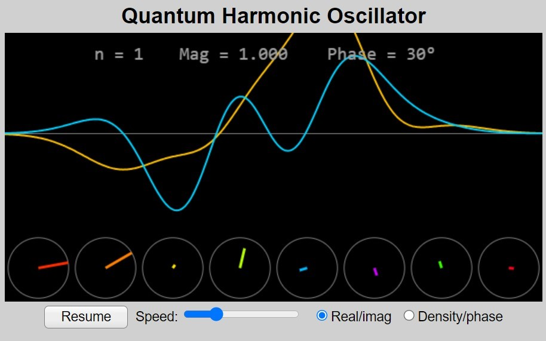

### Procedure
Step 1: Change the clock ticks to change curve so the curve changes 
 
Step 2: Study the graph 
Step 3: Control speed and study graph 
Step 4: finish with the experiment 
Step 5: Note down the amplitude of each state (n =9 : no of states) keeping magnitude same see how the phase is changing for each state . 
Step 6: Fill in the table 
<table style="width:100%">
<tr>
<th style="width:0.5%" >S.no</th>
<th style="width:20%">No of State(n)</th>
<th style="width:20%">Magnitude</th>		
</tr>
<tr>
<th>1.</th>
<th></th>
<th></th>
</tr>
<tr>
<th>2.</th>
<th></th>
<th></th>

</tr>
<tr>
<th>3.</th>
<th></th>
<th></th>

</tr>
<th>4.</th>
<th></th>
<th></th>

</tr>
<tr>
<th>5.</th>
<th></th>
<th></th>

</tr>
<tr>
<th>6.</th>
<th></th>
<th></th>

</tr>
<tr>
<th>7.</th>
<th></th>
<th></th>

</tr>
</table>
