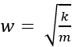
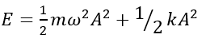
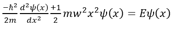
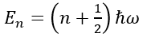

Oscillations are a ubiquitous phenomenon observed in various natural systems, from vibrating molecules to celestial bodies. Understanding the behavior of oscillating systems is crucial in physics, as it provides insights into the fundamental principles governing the dynamics of particles and waves. Classical mechanics has long been employed to analyze macroscopic oscillations, such as those of a block on a spring or a pendulum. However, when it comes to microscopic systems or situations where quantum effects are significant, classical mechanics falls short, and quantum mechanics becomes indispensable.
In this context, the quantum harmonic oscillator emerges as a fundamental concept in quantum mechanics. It represents a particle or system undergoing harmonic motion in the quantum realm, where classical mechanics no longer holds sway. The study of the quantum harmonic oscillator not only deepens our understanding of quantum mechanics but also finds applications in various fields, including molecular spectroscopy, solid-state physics, and quantum computing.
The theory of the quantum harmonic oscillator begins with the classical harmonic oscillator, where a particle undergoes harmonic motion about an equilibrium position under the influence of a restoring force provided by a spring. In classical mechanics, the motion of such a particle is described by Newton's laws, resulting in equations of motion and energy expressions that characterize the oscillatory behavior.
1.	Classical Harmonic Oscillator: Consider a particle of mass (m) moving back and forth along the x-direction about the equilibrium position x=0. In classical mechanics, the particle experiences a linear restoring force given by Fx = -Kx, where x is the displacement from equilibrium and k is the force constant of the spring.
The motion of the particle is described by the equation:x(t)=A cos⁡(wt+∅) 
Where A is the amplitude, is the angular frequency, and ϕ is the phase angle. 
The total energy E of the oscillator is the sum of its kinetic energy K and elastic potential energy U(x): 

At the turning points  x=±A, the kinetic energy is zero, and the energy of oscillation is solely in the form of potential energy, 

2.	Quantum Oscillator: The theoretical foundation of the quantum oscillator experiment is rooted in the Schrödinger equation, which describes the behaviour of quantum systems. For a harmonic oscillator potential, the time-independent Schrödinger equation takes the form:  
 
Where: 
	ℏ is the reduced Plank constant,  
	m is the mass of the particle, 
	ω is the angular frequency of the oscillator potential, 
	E represents the energy eigenvalues 
	Ψ(x) denotes the wavefunction. 
The solutions to this equation yield the energy eigenvalues En and corresponding wavefunctions ψn (x) for the quantum harmonic  oscillator. The energy levels are quantized and given by: 
 
Where n is a non-negative integer representing the quantum number.

